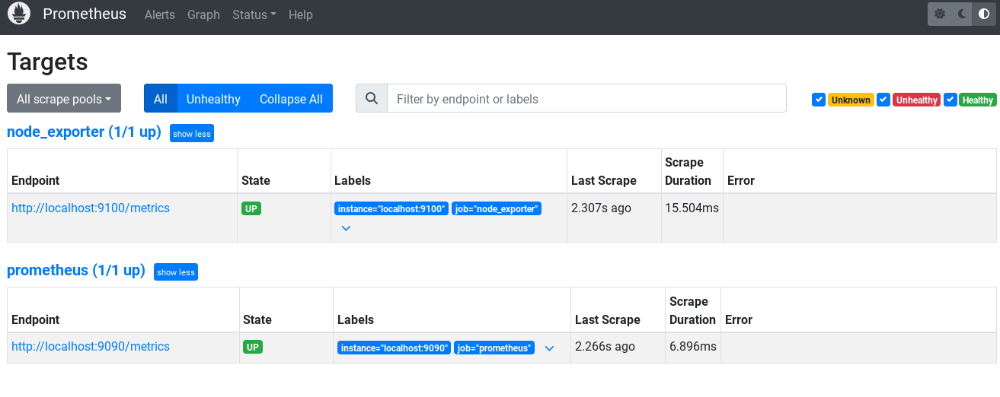

<h1>Download&Work w/ Prometheus</h1>

<div align="center">
  <pre>
  ███████╗██████╗ ██╗  ██╗██╗  ██╗██╗   ██╗██████╗ 
  ██╔════╝██╔══██╗██║ ██╔╝██║  ██║██║   ██║██╔══██╗
  ███████╗██████╔╝█████╔╝ ███████║██║   ██║██████╔╝
  ╚════██║██╔═══╝ ██╔═██╗ ██╔══██║██║   ██║██╔══██╗
  ███████║██║     ██║  ██╗██║  ██║╚██████╔╝██████╔╝
  ╚══════╝╚═╝     ╚═╝  ╚═╝╚═╝  ╚═╝ ╚═════╝ ╚═════╝ 
  </pre>
</div>

## docker + docker-compose to use in astra linux ##
```bash
sudo apt install docker.io
sudo usermod -aG docker $USER
newgrp docker
docker ps
```

<h3>docker compose(docker -v == 18.09.7) </h3>

```bash
sudo curl -L "https://github.com/docker/compose/releases/download/1.29.2/docker-compose-$(uname -s)-$(uname -m)" -o /usr/local/bin/docker-compose
sudo chmod +x /usr/local/bin/docker-compose
```
<h1>Install grafana + prometheus + node_exporter</h1>

<h2>Prometheus</h2>

```bash
sudo useradd --no-create-home --shell /bin/false prometheus
sudo useradd --no-create-home --shell /bin/false node_exporter
sudo mkdir /etc/prometheus
sudo mkdir /var/lib/prometheus
sudo chown prometheus:prometheus /etc/prometheus
sudo chown prometheus:prometheus /var/lib/prometheus
cd /tmp
wget https://github.com/prometheus/prometheus/releases/download/v2.51.0/prometheus-2.51.0.linux-amd64.tar.gz
tar -xvf prometheus-2.51.0.linux-amd64.tar.gz (tab)
cd prometheus-2.51.0.linux-amd64
sudo cp prometheus /usr/local/bin
sudo cp promtool /usr/local/bin
sudo chown prometheus:prometheus /usr/local/bin/prometheus
sudo chown prometheus:prometheus /usr/local/bin/promtool
sudo cp -r consoles /etc/prometheus
sudo cp -r console_libraries /etc/prometheus
sudo cp prometheus.yml /etc/prometheus/prometheus.yml
sudo chown -R prometheus:prometheus /etc/prometheus
```
> sudo nano /etc/prometheus/prometheus.yml

```yaml
global:
  scrape_interval: 15s
  evaluation_interval: 15s

scrape_configs:
  - job_name: 'prometheus'
    static_configs:
      - targets: ['localhost:9090']

  - job_name: 'node_exporter'
    static_configs:
      - targets: ['localhost:9100']
```

> sudo nano /etc/systemd/system/prometheus.service

```ini
[Unit]
Description=Prometheus
Wants=network-online.target
After=network-online.target

[Service]
User=prometheus
Group=prometheus
Type=simple
ExecStart=/usr/local/bin/prometheus \
        --config.file=/etc/prometheus/prometheus.yml \
        --storage.tsdb.path=/var/lib/prometheus/ \
        --web.console.templates=/etc/prometheus/consoles \
        --web.console.libraries=/etc/prometheus/console_libraries

[Install]
WantedBy=multi-user.target
```

```bash
sudo systemctl daemon-reload
sudo systemctl enable --now prometheus
prometheus at localhost:9090
```
### 🛠️ Основные команды для управления Prometheus

| Действие | Команда |
|----------|---------|
| Запустить | `sudo systemctl start prometheus` |
| Остановить | `sudo systemctl stop prometheus` |
| Проверить статус | `sudo systemctl status prometheus` |

<details>
<summary>📋 Посмотреть полный вывод статуса (пример)</summary>
  
```bash
● prometheus.service - Prometheus
   Loaded: loaded (/etc/systemd/system/prometheus.service; enabled; vendor preset: enabled)
   Active: active (running) since Mon 2026-??-?? 05:55:55 MSK; 1h 55min ago
 Main PID: 15058 (prometheus)
    Tasks: 10 (limit: 4915)
   Memory: 17.3M
      CPU: 12.178s
   CGroup: /system.slice/prometheus.service
           └─15058 /usr/local/bin/prometheus ...
```
</details>
<h2>NODE EXPORTER</h2>

```bash
cd /tmp
wget https://github.com/prometheus/node_exporter/releases/download/v1.7.0/node_exporter-1.7.0.linux-amd64.tar.gz
tar -xvf node_exporter-1.7.0.linux-amd64.tar.gz
sudo cp node_exporter-1.7.0.linux-amd64/node_exporter /usr/local/bin
sudo chown node_exporter:node_exporter /usr/local/bin/node_exporter
```

> sudo nano /etc/systemd/system/node_exporter.service

```ini
[Unit]
Description=Node Exporter
Wants=network-online.target
After=network-online.target

[Service]
User=node_exporter
Group=node_exporter
Type=simple
ExecStart=/usr/local/bin/node_exporter

[Install]
WantedBy=multi-user.target
```

```bash
sudo systemctl daemon-reload
sudo systemctl enable --now node_exporter
sudo systemctl restart prometheus
```

<details>
<summary>✅ Успешная работа prometheus + node_exporter</summary>

#### *state is up* ####


</details>

<h2>GRAFANA</h2>

```bash
sudo apt install -y apt-transport-https software-properties-common wget
sudo mkdir -p /etc/apt/keyrings/
wget https://dl.grafana.com/oss/release/grafana_10.4.1_amd64.deb
sudo apt install ./grafana_10.4.1_amd64.deb
sudo systemctl daemon-reload
sudo systemctl enable grafana-server
sudo systemctl start grafana-server
sudo systemctl status grafana-server
```

> localhost:9100 - node_exporter \
> localhost:9090 - Prometheus \
> localhost:3000 - Grafana 


<h1>Results</h1>

<details>
<summary>✅ Success</summary>
  
| Действие | Команда |
|----------|---------|
| ***open grafana*** | `localhost:3000` |
| ***login&password*** | `admin : admin` |
| ***установить коннект*** | `> Home > Connections > Add new connection > Prometheus > Add new data source > http://localhost:9090 > Save&Test ` |
| ***дашборд 1860*** | `> Home > Dashboards > new > import > enter 1860 id(or smth like that)` |
| ***Проверить визуализацию*** | `go to dashboards > pick ur dashboard > chill` |

</details>
